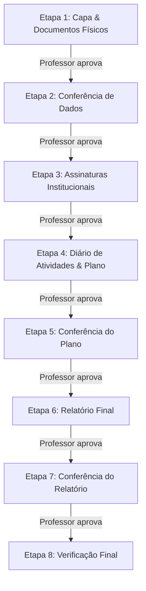

# Manual do Estagiário

## Sistema de Gestão de Estágios do Curso de Sistemas de Informação

## UEMG - Unidade Carangola

Bem-vindo ao **SGE - Sistema de Gestão de Estágios do Curso de Sistemas de Informação da UEMG - Unidade Carangola**! Este manual foi desenvolvido para guiar você, estagiário, em todas as etapas de regularização do seu estágio curricular obrigatório. O sistema foi projetado para centralizar o fluxo de acompanhamento, gerando os documentos necessários e organizando o processo em **8 etapas sequenciais**.

---

## 1. Primeiro Acesso e Cadastro

### 1.1. Cadastro na Plataforma

Os alunos podem realizar o cadastro diretamente no sistema, desde que a **Janela de Cadastro** esteja aberta pela administração.

* Para se cadastrar, acesse a tela de registro, preencha seus dados pessoais (nome completo, e-mail, matrícula e período atual) e defina uma senha segura.
* **Senha segura:** Garanta que sua senha tenha no mínimo **8 caracteres** para atender aos critérios de segurança.

> [!IMPORTANT]
> Se o cadastro estiver bloqueado com a mensagem de que a janela está fechada, aguarde a liberação da secretaria ou entre em contato com o coordenador do seu curso.
> **Importante:** Professores e orientadores não podem se cadastrar sozinhos; suas contas são criadas exclusivamente pelo administrador do sistema.

### 1.2. Gerenciamento do Perfil

Após o login, você poderá acessar a página **"Minha Conta"** (no menu superior ou lateral) para:

* Atualizar seu telefone de contato.
* Alterar sua senha de acesso.
* Verificar a consistência dos seus dados cadastrais.

---

## 2. Iniciando um Processo de Estágio

Se você não possui nenhum estágio ativo, sua tela inicial (Dashboard) apresentará um aviso informando que você ainda não iniciou sua jornada.

1. Clique no botão **"Iniciar Novo Estágio"** (disponível no topo e no centro da dashboard).
2. O sistema identificará automaticamente o seu período letivo atual e exibirá as **Ofertas de Estágio** ativas específicas para você. Se nenhuma oferta estiver cadastrada para seu período, entre em contato com a coordenação.
3. Preencha o formulário detalhado, que está dividido em três seções:
   * **Dados da Empresa (Campo de Estágio):** Razão Social, Nome Fantasia, CNPJ, telefone e e-mail.
   * **Dados do Supervisor:** Nome completo, cargo, e-mail, telefone de contato, área de formação e titulação máxima (Especialista, Mestre, Doutor, etc.).
   * **Detalhes do Estágio:** Modalidade (Presencial, Híbrido ou Remoto), tipo de documentação (TCE, Estágio Obrigatório ou Não-Obrigatório), data de início prevista, carga horária diária (em horas) e a descrição das suas atribuições/atividades.

### ✨ Aprimoramento das Atividades com IA

Ao redigir o campo de atribuições/atividades, você verá um botão chamado **"Sugestão de Aprimoramento com IA"**.

* Seus textos de atividades devem ser profissionais e claros. Caso precise de ajuda, clique neste botão para que nossa inteligência artificial analise e reescreva sua descrição em um formato acadêmico formal e sem erros de português.
* **Nota:** A IA não adicionará saudações nem formatações complexas (Markdown), inserindo o texto polido diretamente no campo.

---

## 3. Entendendo as 8 Etapas do Estágio

O SGE utiliza um **fluxo sequencial rigoroso**. Isso significa que você só poderá agir na etapa atual. O botão de ação na dashboard refletirá sempre a sua responsabilidade imediata.

Abaixo, veja o que fazer em cada uma das 8 etapas obrigatórias:

### Etapa 1: Entrega de Documentos Físicos (Sua Ação)

* **Objetivo:** Informar as especificações do estágio e emitir a folha de capa.
* **Ação no Sistema:** Clique em **"Emitir a Capa do Estágio"**. Revise todos os dados e clique em **"Gerar PDF / Imprimir"**. O sistema irá gerar um PDF no seu navegador com layout oficializado.
* **Ação Física (Fora do Sistema):** Imprima a Capa gerada, anexe-a ao Termo de Compromisso de Estágio (TCE) físico assinado pelas partes e protocole os documentos na secretaria/protocolo da UEMG.

### Etapa 2: Conferência de Dados (Aguardar)

* **Objetivo:** O professor orientador analisará se as informações inseridas no sistema batem com o documento físico protocolado.
* **Ação no Sistema:** Nenhuma. Apenas aguarde a validação.

### Etapa 3: Assinaturas Institucionais (Aguardar)

* **Objetivo:** Coleta de assinaturas internas da UEMG.
* **Ação no Sistema:** Nenhuma. Acompanhe se o status passa para concluído.

### Etapa 4: Entrega do Plano de Atividades (Sua Ação)

* **Objetivo:** Preencher seu diário de atividades prático e totalizar a carga horária exigida pelo curso.
* **Ação no Sistema:** Clique em **"Preencher Plano de Atividades"** para acessar o **Diário de Atividades**.
  * **Regras de Lançamento de Atividades:**
    * **Horas diárias:** Você não pode registrar mais horas em um dia do que a carga horária diária do seu contrato (ex: se seu contrato é de 6h/dia, você não pode lançar 8h em uma data).
    * **Limites de data:** Você só pode registrar atividades em datas compreendidas entre o início do estágio e o fim do semestre (cadastrado na oferta do curso).
    * **Dias bloqueados:** O sistema bloqueia automaticamente lançamentos em **finais de semana (sábados e domingos)**, **feriados** e **recessos acadêmicos**. A lista de feriados cadastrados fica visível na barra lateral para sua consulta.
    * **Alterações:** Você pode cadastrar e excluir lançamentos livremente enquanto estiver nesta etapa.
  * **Conclusão:** Continue lançando suas atividades diárias até que a barra de progresso atinja **100% da Carga Horária Exigida** (ex: 150 horas). Ao atingir a meta, um botão **"Gerar PDF"** ficará disponível. Clique para emitir o PDF formatado do seu Plano de Atividades.
* **Ação Física:** Imprima o documento gerado pelo sistema, recolha as assinaturas físicas (sua e do supervisor da empresa) e protocole o documento na instituição.

### Etapa 5: Conferência do Plano (Aguardar)

* **Objetivo:** O professor orientador avaliará se as atividades descritas no seu diário físico coincidem com as do sistema e se são condizentes com o curso.
* **Ação no Sistema:** Nenhuma. Aguarde a validação.

### Etapa 6: Entrega do Relatório Final (Sua Ação)

* **Objetivo:** Elaborar o relatório final consolidando os resultados de seu estágio.
* **Ação no Sistema:** Clique em **"Preencher Relatório Final"**.
  * **Trava Temporal:** Por regras de conformidade, você **só poderá redigir seu relatório final a partir do dia seguinte ao último dia de atividade registrado no seu Diário** (Etapa 4). Se tentar acessar antes disso, o sistema mostrará um aviso amarelo de bloqueio informativo: *"Disponível em: [Data]"*.
  * **Preenchimento:** Escreva sua autoavaliação (mínimo de 50 caracteres).
  * **Aprimoramento com IA:** Clique em **"Sugestão de Aprimoramento com IA"** para que a inteligência artificial organize suas ideias em um português acadêmico impecável.
  * **Exportação:** Clique em **"Gerar PDF do Relatório Final"**. O sistema salvará seu texto no banco de dados e baixará automaticamente o arquivo PDF.
* **Ação Física:** Imprima o PDF do Relatório Final, assine, colete as assinaturas do Supervisor e do Professor Orientador, e protocole o documento na instituição.

### Etapa 7: Conferência do Relatório (Aguardar)

* **Objetivo:** O professor orientador avaliará o relatório final físico entregue.
* **Ação no Sistema:** Nenhuma. Aguarde a aprovação do orientador.

### Etapa 8: Verificação Final (Aguardar)

* **Objetivo:** Homologação final do estágio no sistema.
* **Ação no Sistema:** Nenhuma. Ao final desta etapa, seu contrato constará como concluído com sucesso.

---

## 4. Gerenciamento de Prazos, Alertas e Correções

### 4.1. Monitoramento de Prazos

Na dashboard, abaixo do título de cada etapa pendente, o sistema exibirá uma contagem de prazos:

* **"Prazo para concluir esta etapa: DD/MM/AAAA"**.
* O prazo é calculado dinamicamente adicionando o número de dias úteis/limites configurados pelo administrador a partir da data de conclusão da etapa anterior.
* **Atenção:** Se o prazo for ultrapassado, a data ficará destacada em **vermelho e negrito**, indicando que a etapa está atrasada. O orientador poderá enviar e-mails de cobrança automatizados nesses cenários.

### 4.2. Fluxo de Correções (Status "REJEITADO")

Se o professor orientador ou a instituição encontrarem alguma divergência entre as informações digitadas e o documento físico, a etapa correspondente será alterada para o status **"REJEITADO"**.

* **Alerta Vermelho na Dashboard:** Um card de alerta vermelho de alta visibilidade aparecerá no topo do seu contrato, contendo a data da rejeição e a observação detalhada escrita pelo professor.
* **Correção:** Você deve ler com atenção o feedback do orientador, clicar no botão correspondente da etapa e corrigir os dados necessários (por exemplo, na Etapa 1, você poderá editar os dados da capa novamente para sanar as inconsistências).
* **Reenvio:** Ao salvar as alterações ou gerar um novo documento corrigido, o processo volta para análise do orientador.

> [!NOTE]
> **Ajustes de Capa (Etapa 1):** Caso o professor note que dados como o nome da empresa ou o nome do supervisor estão errados durante a Etapa 1, ele rejeitará a etapa. O sistema abrirá novamente todos os campos do formulário de cadastro para que você faça os ajustes sem precisar cancelar o processo.

---

## 5. Regras de Ouro para o Sucesso do Estágio

1. **A Fonte da Verdade é o Documento Físico:** O sistema armazena apenas metadados (valores, datas e textos). A sua regularização legal depende estritamente de protocolar os documentos assinados fisicamente.
2. **Atenção aos Feriados:** Planeje seus lançamentos no Diário (Etapa 4) sabendo que dias sem atividade oficial (feriados, recessos e finais de semana) não somam horas.
3. **Não perca prazos:** Sempre fique de olho no indicador de prazo na sua dashboard. Prazos estourados são passíveis de notificações diretas no seu e-mail cadastrado.
4. **Use a IA como aliada:** Aproveite o botão de sugestão de aprimoramento de texto para garantir que suas descrições de atividades e relatórios finais atendam ao tom formal exigido pela banca e coordenação.
